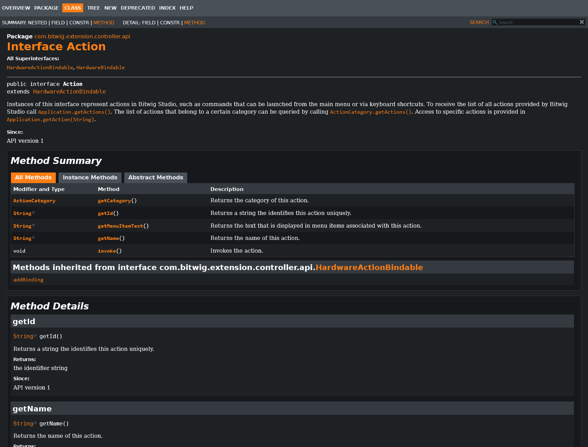

# Bitwig API Stylesheet Dark Theme

A custom dark theme stylesheet for the Bitwig Studio Controller API documentation that enhances readability and reduces eye strain during late-night coding sessions.

## Features

- Dark theme optimized for reduced eye strain
- Color palette inspired by Bitwig Studio's interface
- Improved typography and spacing for better readability

## Installation

1. Make a backup of your original stylesheet file
2. Replace the following file:

`YOURBITWIGFOLDER\resources\doc\control-surface\api\**stylesheet.css**`

Example path:

`c:\Program Files\Bitwig Studio 5.3 Beta 8\resources\doc\control-surface\api\**stylesheet.css**`

## Screenshot

### Before:

### After:

